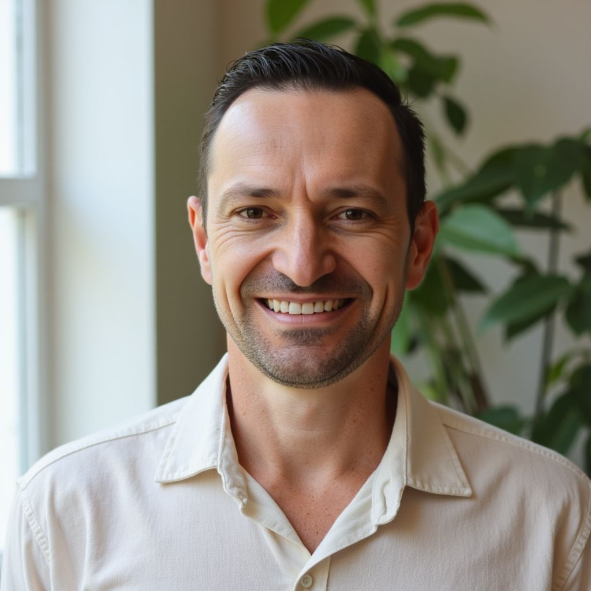
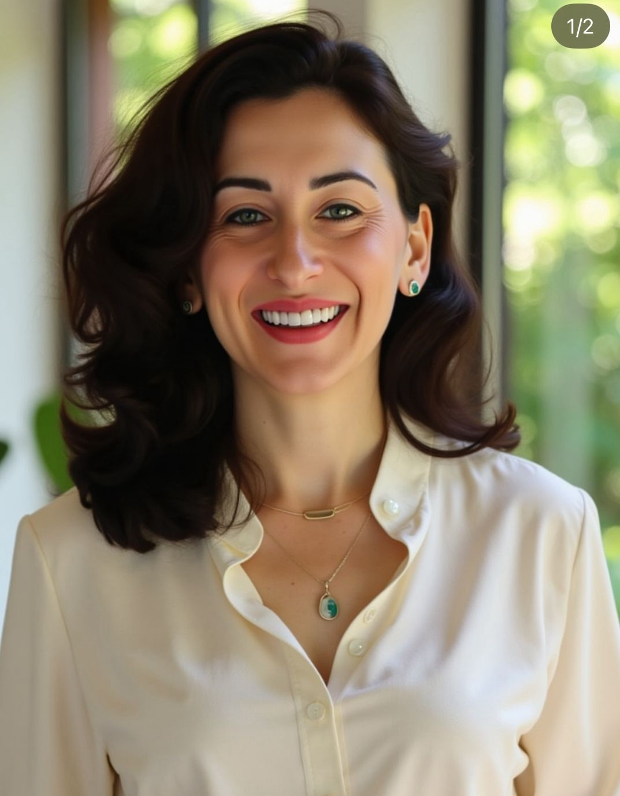

<html lang="pt-br">
<head>
  <meta charset="utf-8" />
  <meta name="viewport" content="width=device-width, initial-scale=1" />
  <title>Vivência de Meditação & Respiração Terapêutica</title>
  <meta name="description" content="Vivência prática para reduzir estresse, acalmar a mente e reconectar com a presença — conduzida por Evandro & Alinne." />
  <meta property="og:title" content="Vivência de Meditação & Respiração Terapêutica" />
  <meta property="og:description" content="Respiração consciente, meditação guiada e relaxamento profundo para leveza e clareza." />
  <meta property="og:type" content="website" />
  <meta property="og:image" content="https://via.placeholder.com/1200x930.png?text=Meditacao+%26+Respiracao+Terapeutica" />
  <meta name="twitter:card" content="summary_large_image" />

  
</head>
<body>

  <!-- Topo -->
  
VIVÊNCIA DE MEDITAÇÃO & RESPIRAÇÃO TERAPÊUTICA

  <!-- Hero -->
  

    

      

        <h1 style="margin:0;font-size:clamp(32px,5vw,48px)">Respire fundo. Viva leve.</h1>
        
Respiração consciente, meditação guiada e relaxamento profundo para reduzir estresse, organizar os pensamentos e cultivar presença no dia a dia.

        

        

          <a href="#inscricao" class="btn primary">Quero participar</a>
          <a href="https://wa.me/5549998110445?text=Quero%20saber%20mais%20sobre%20a%20Viv%C3%AAncia" class="btn ghost" target="_blank" rel="noopener">Falar no WhatsApp</a>
        

      

    

  

  <!-- O que é -->
  <section>
    

      O que é
      <h2 class="section-title" style="margin-top:10px">Vivência terapêutica</h2>
      

        

          <h3 class="grad-left">Integração mente–corpo</h3>
          
Respiração, meditação e atenção plena para desacelerar e abrir espaço para clareza emocional.

        

        

          <h3 class="grad-left">Aplicável no dia a dia</h3>
          
Ferramentas simples que você leva para a rotina: pausas conscientes, presença e autocuidado.

        

      

    

  </section>

  <!-- Benefícios -->
  <section>
    

      Benefícios
      <h2 class="section-title" style="margin-top:10px">Resultados que você sente</h2>
      

        

          <h3 class="grad-left">Menos estresse</h3>
          
Reduz ansiedade e tensão física.

        

        

          <h3 class="grad-left">Sono melhor</h3>
          
Mente mais calma para noites restauradoras.

        

        

          <h3 class="grad-left">Clareza e foco</h3>
          
Organiza pensamentos e apoia decisões.

        

        

          <h3 class="grad-left">Presença</h3>
          
Mais conexão consigo e com a vida.

        

      

    

  </section>

  <!-- Instrutores -->
  <section>
    

      Instrutores
      <h2 class="section-title" style="margin-top:10px">Evandro &amp; Alinne</h2>

      

        <!-- Evandro -->
        <figure class="inst-card">
          

            
          

          <figcaption>
            
Evandro

            
Facilitador • Respiração & Meditação

          </figcaption>
        </figure>

        <!-- Alinne -->
        <figure class="inst-card">
          

            
          

          <figcaption>
            
Alinne

            
Facilitadora • Respiração & Presença

          </figcaption>
        </figure>
      

    

  </section>

  <!-- Investimento -->
  <section id="inscricao">
    

      

        Investimento
        
R$ 440,00

        

          <a href="https://wa.me/5549998110445?text=Quero%20garantir%20minha%20vaga" class="btn primary" target="_blank" rel="noopener">Garantir minha vaga</a>
        

      

    

  </section>

  <!-- Depoimentos -->
  <section>
    

      Depoimentos Reais
      <h2 class="section-title" style="margin-top:10px">O que as pessoas sentiram</h2>
      

        

Ivete

“A vivência de ontem foi maravilhosa. Aprendi que preciso controlar meus pensamentos. Saí em paz, com uma leveza que nunca senti; tive uma noite de sono muito tranquila. Estou decidida a mudar.”

        

Germano

“Meditação e respiração de hoje foi incrível; cada vez que participo fica melhor — daí não dá vontade de parar kkkk.”

        

Aline

“Hoje foi muito bom. Sou grata pela experiência, pois me trouxe leveza, presença e conexão.”

        

Marisa

“Percebi o quanto é importante dar atenção ao pensamento e à respiração, desacelerar. O que aprendemos já está me ajudando no dia a dia.”

        

Michely

“Um dia maravilhoso de muito aprendizado. A partir de hoje vou ser outra pessoa. Agradeço à Aline, ao Evandro e a todos que estiveram presentes.”

        

Idalina

“Fui com a ideia de ‘meditação normal’. Saí outra Idalina — leve, tranquila e confiante. A troca de energias do grupo é mágica. Estou renovada em paz.”

        

Onira

“A vivência me tranquilizou, organizou os pensamentos. Agora, seguir com calma na alma.”

      

    

  </section>

  <!-- FAQ -->
  <section>
    

      FAQ
      <h2 class="section-title" style="margin-top:10px">Perguntas Frequentes</h2>
      

        

          <button class="faq-q" aria-expanded="false">Preciso ter experiência prévia?+</button>
          

Não. É para todos os níveis — você será guiado passo a passo.

        

        

          <button class="faq-q" aria-expanded="false">O que levar?+</button>
          

Roupas confortáveis, água e, se quiser, seu tapete/almofada.

        

        

          <button class="faq-q" aria-expanded="false">Duração do encontro+</button>
          

Imersão de aproximadamente 3 horas.

        

      

    

  </section>

  <footer>© 2025 Vivência de Meditação & Respiração Terapêutica — Todos os direitos reservados.</footer>

  <!-- JS FAQ -->
  
</body>
</html>
